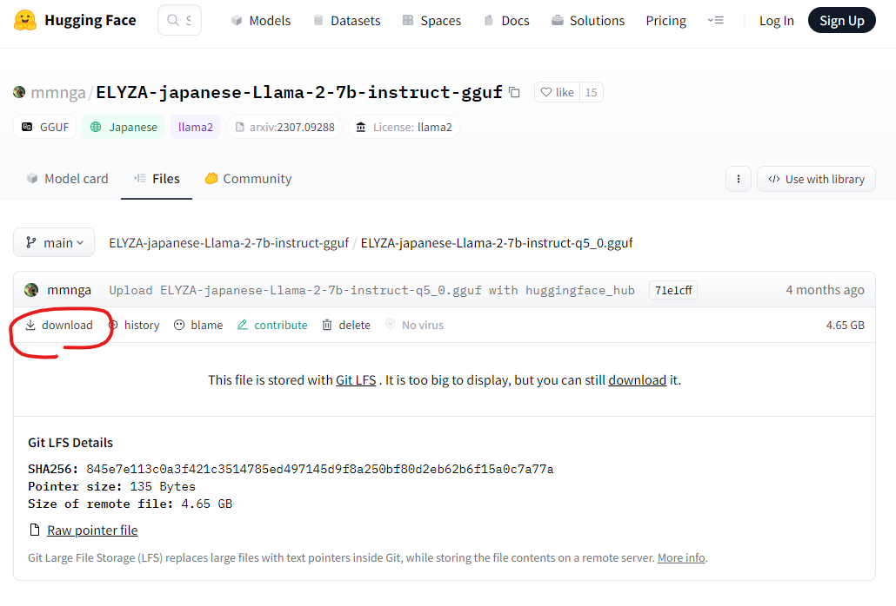

# dotnet_LLamaSharp_example1

## 概要

大規模言語モデル ( LLM ) をローカルで動かすのは、高い GPU を買わないとできないと思っていたが、
llama.cpp という CPU だけで LLM を実行できるツールがあることを知った。  
また、色々な開発言語のラッパーが存在し、その中に C# もあったため試しに動かしてみた。

llama.cpp  
https://github.com/ggerganov/llama.cpp  

LLaMaSharp  
https://github.com/SciSharp/LLamaSharp  
https://www.nuget.org/packages/LLamaSharp  

> llama.cppの C#/.NET バインディング。LLaMA モデルを推論し、C#/.NET を使用してローカル デバイスにデプロイするための高レベル API を提供します。llama.cpp を自分でコンパイルする必要がなく、Windows、Linux、Mac で動作します。GPU がなくても、GPU メモリが不足していても、LLaMA モデルを使用できます。🤗

LLamaSharp.Backend.Cpu  
https://www.nuget.org/packages/LLamaSharp.Backend.Cpu  

## 感想
* ゲキ遅だが動かせたことに感動。こんな簡単にできるならもっと早く試せばよかった。
* 今のところ回答速度・精度ともに実用的ではない。（汎用的な用途としては）  
  現状 CPU で現実的にギリ動かせるのが 7B までと思われるが、それでも 1 回の回答に 2 分以上かかる上に、普通に間違ったことを言ってくる。  
  そもそも現時点ではローカルで動く ChatGPT を期待する方が間違っている。
* NTT が 0.6B の日本語のモデルを発表している。  
  試したことは無いが、これならまともな速度で動くかもしれない。  
  回答精度については、そもそも普段の業務で日本の首都とか聞く必要は無いし、中途半端に間違ったことを言うぐらいなら無い方がマシで、業務知識だけを学習させた言語モデルが作れた方が使い勝手が良いかもしれない。

  NTT版大規模言語モデル「tsuzumi」  
  https://www.rd.ntt/research/LLM_tsuzumi.html

## 詳細

※注意！  
現在 v1.0 に向けて色々整理・変更してるとのこと。  
その影響かは不明だが、公式のサンプル通りに動かないところが多々あった。  
(2024/1/8時点)

### 環境構築

```
dotnet new console
dotnet add package LLamaSharp --version 0.9.1
dotnet add package LLamaSharp.Backend.Cpu --version 0.9.1
```

### モデル入手
以下をダウンロード ( 約 4.5 GB ) し、`C:\models` に配置(※)  
※配置場所は任意だが、上記以外にする場合は Program.cs の `modelPath` の書き換えが必用

https://huggingface.co/mmnga/ELYZA-japanese-Llama-2-7b-instruct-gguf/blob/main/ELYZA-japanese-Llama-2-7b-instruct-q5_0.gguf



### 実行

※注意！  
クソ遅い。回答の一文字目が返ってくるまでに 1 分近くかかり、  
その後、1 文字 1 秒ぐらいかけて、ゆっくりゆっくり表示される。  
また、速度を優先しているので致し方ないが、回答に聞いたことない単語が混じっている。  
(たぶん間違ってる)

遅すぎて待ってられないので、以下の GIF では等速版と倍速版の 2 つ貼っている。

```
dotnet run
```

等速  
.gif)

倍速  
.gif)

### 実行中のリソース利用確認

### まとめ
* 実行すると llama まわりの設定が一瞬で終わり、その後モデルの読み込みが始まる
* 1 分かけて約 4 GB 読み込まれる = モデルのサイズと一致
* 読み込み後、推論結果が 1 文字 1 秒程度かけて表示される
* 実行中の CPU 使用率は、開始から終了まで天井に張り付きっぱなしになる
* 実行完了後、メモリが一気に開放される = 4 GB ぐらいバコっと減る

### 詳細
* 実行前  
  CPU 6 %  
  メモリ 6.7 GB
* `dotnet run` 実行
* llama_load と llama_new が終わった直後　※ここまで約 5 秒  
  CPU 82 %  
  メモリ 7.4 GB
* 回答の 1 文字目が表示　※ここまで約65秒  
  CPU 83 %  
  メモリ 11.6 GB　※1 分で 4 GB 増加
* 回答の最後を表示　※ここまで約 170 秒  
  CPU 81 %  
  メモリ 11.4 GB
* 実行終了直後　※ここまで約 171 秒  
  CPU 66 %　※この後すぐ下がった  
  メモリ 6.6 GB

.gif)

## 環境

```
> dotnet --info
.NET SDK:
 Version:           8.0.100
 Commit:            57efcf1350
 Workload version:  8.0.100-manifests.3b83835e

ランタイム環境:
 OS Name:     Windows
 OS Version:  10.0.19045
 OS Platform: Windows
 RID:         win-x64
 Base Path:   C:\Program Files\dotnet\sdk\8.0.100\
```

```
> systeminfo
システム製造元:         LENOVO
システム モデル:        20HQS1BJ00
システムの種類:         x64-based PC
プロセッサ:             1 プロセッサインストール済みです。
                        [01]: Intel64 Family 6 Model 142 Stepping 9 GenuineIntel ~2611 Mhz
物理メモリの合計:       16,027 MB
仮想メモリ: 最大サイズ: 18,459 MB
```


